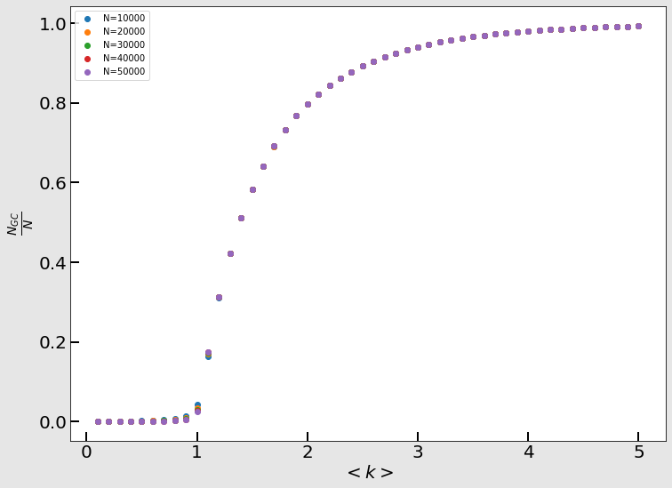

# Random Network

## 이론
> Network와 Graph를 혼용해서 사용하고 있지만, 같은 의미입니다.
> 또한, Graph의 기초에 대해서는 설명하지 않겠습니다. 

### Random Network의 정의
Randon Network는 이름에서 추론 가능하듯이, 각 node간의 link가 random하게 연결되는 network를 말합니다. 수학적으로 표현하기 위해 $G(n,p)$라는 이름을 붙이도록 하겠습니다. $n$은 network의 node 수 이며, $p$는 link가 생성될 확률입니다. $G(n,p)$는 단일 graph에 대한 표현이 아니라 **ensemble**로써의 표현임을 명심해주시기 바랍니다.

위 표현에 의해 $G(n,p)$는 다음과 같은 이항분포로 나타납니다
$$
\begin{aligned}
	P(G)		=	p^m{(1-p)}^{{n \choose 2}-m}	\tag1
\end{aligned}
$$

여기서 $m$은 이 network의 전체 link 수를 말합니다. Link란 결국 2개의 node 쌍을 만드는 것이므로, 가능한 전체 link 수는 ${n\choose2}$개가 됩니다. 그중에서 실제로 만들어지는 link 수가 $m$이라는 뜻입니다.

### Mean Degree $\left \langle k \right\rangle$
Mean degree란 말그대로 degree의 평균을 뜻하며, 좀 더 풀어서 설명하자면, 어떤 node를 선택 했을때 이 node가 갖고 있을 link의 수 $k$(*를 degree라 부릅니다*)의 기댓값입니다. 후술하겠지만 $\left\langle k \right\rangle$는 link가 형성될 확률 확률 $p$와 밀접한 관련이 있습니다. 

우선 특정 $n$에 대해서 random network가 $m$개의 link를 가질 확률을 생각해보도록 하겠습니다.  이는 ensemble이 나타날 확률과 그 ensemble이 가지는 microstate의 가짓수를 생각하면 쉽게 구할 수 있습니다.
$$
\begin{aligned}
	P(m)	&=	{{n \choose 2} \choose m}P(G)\\
				&=	{{n \choose 2} \choose m}p^m{(1-p)}^{{n \choose 2}-m}\\
				&\sim	B\left({n \choose 2},p\right)	\tag2
\end{aligned}
$$
단순한 이항분포이므로 link수의 평균 또한 쉽게 구할 수 있습니다.
$$
\begin{aligned}
	\left\langle m \right\rangle
		&=	{n \choose 2}p
		&=	\frac{n(n-1)p}{2}	\tag3
\end{aligned}
$$

이제 mean degree의 정의를 잘 생각해보면 $\left\langle k \right\rangle = 2m/n$ 이라는 것을 알 수 있습니다. 즉, 식 (3)에 의해 우리는 다음과 같은 결론을 얻을 수 있습니다.
$$
\begin{aligned}
	\left\langle k \right\rangle
		&=	(n-1)p	\tag4
\end{aligned}
$$

### Degree Distribution
Mean degree를 구했으니 이제 degree의 분포에 대해 알아보도록 하겠습니다. $p_k$는 $P(m)$을 구할때와 마찬가지로, 특정 node에 대해 자기자신을 제외한 $n-1$개의 node에 link를 연결할 확률이므로 다음과 같이 표현 가능합니다.
$$
\begin{aligned}
	p_k		&\sim	B(n-1, p)\\
				&=	{n-1\choose k}p^k{(1-p)}^{(n-1)-k} \tag5
\end{aligned}
$$
저희 교수님께선 이런 말씀을 하셨습니다. 

**"물리학자는 $n=1, 2, \infty$ 일때밖에 계산을 못한다."**

Network를 형성한다는 것은 **많은 것**에 대해 관심이 있다는 뜻. 즉 우리는 $n$이 충분히 큰 경우, 좀 더 자극적으로 말하자면 $n\to\infty$인 경우를 생각하고자 합니다. 

식 (4)에 의해서 우리는 $p$를 $\left\langle k \right\rangle$로 나타낼 수 있다는 것을 알아냈습니다. 이를 이용하여 식 (5)의 ${(1-p)}^{(n-1)-k}$를 근사시키고자 합니다.


$$
\begin{aligned}
	\ln[{(1-p)}^{(n-1)-k}]
		&= [(n-1)-k]\ln[{(1-\frac{\left\langle k \right\rangle}{n-1})}]\\
		&\simeq	-[(n-1)-k]\frac{\left\langle k \right\rangle}{n-1}\\
		&\simeq	-\left\langle k \right\rangle \tag 6
\end{aligned}
$$

첫번째 근사는 Talyor Expansion을 통해 넘어갔으며, 두번째 근사는 $n\to\infty$ 이므로 $k$를 무시하였습니다. 마찬가지 방법으로 식(5)의 이항분포를 근사시키도록 하겠습니다.
$$
\begin{aligned}
	{n-1\choose k}
		&= \frac{(n-1)!}{(n-1-k)!k!}\\
		&\simeq \frac{(n-1)^k}{k!}\tag 7
\end{aligned}
$$

마찬가지로 $n\to\infty$ 이므로 $k$를 무시하였습니다. 이제 식 (6)과 식 (7)을 통해 얻은 결과를 식 (5)에 다시 대입해주면 다음과 같은 결과를 얻을 수 있습니다.

$$
\begin{aligned}
	p_k
		&=	{n-1\choose k}p^k{(1-p)}^{(n-1)-k} \\
		&=	\frac{(n-1)^k}{k!} \left(\frac{\left\langle k \right\rangle}{n-1} \right)^k e^{-\left\langle k \right\rangle}\\
		&=	e^{- \left\langle k \right\rangle}\frac{{\left\langle k \right\rangle}^k}{k!}\\ \tag8
\end{aligned}
$$

위 결과를 통해 random network의 degree distribution은 푸아송 분포를 따른다는 것을 알아낼 수 있었습니다!! 놀랍지 않나요?

### Giant Component
Network 위에서 어떤 interaction을 하는가에 따라 상황에 따라서 우리는 network 위의 모든 node가 이어지게 할 필요가 있습니다. 그러나 mean degree가 작은 경우에는 이어지지 않은 고립된 node가, 조금 위험하게 말하자면, 무조건 존재합니다. 그래서 random network를 형성하고 나서 고립된 node들을 제거, 모든 node가 이어지도록 하는 방법을 쓰곤 합니다. 제가 배우기로는 이 방법을 **burning algorithm**이라고 배웠습니다. 이 알고리즘에 의하면 어떤 network를 형성하고나서 최대한 많은 node를 포함할 수 있는 덩어리, 즉 **Giant cluster**만을 새로운 network로 뽑아냅니다. 우리는 이 임의로 형성된 network의 giant cluster가 얼마나 큰지 알아내고자 합니다.

우선 $u$를 giant cluster에 포함되지 않은 node의 비율이라고 하겠습니다. 10000개의 node중 9000개가 giant cluster에 들어가는 giant component(**GC**)라면 나머지 1000개는 들어가지 않는게 됩니다. 이때 GC의 비율은 0.9이며, $u=0.1$입니다.

우리는 두가지 케이스로 생각할 수 있습니다. node $i$와 node $j$에 대해서 (a) $i$와 $j$의 link가 없는 경우, (b) $i$와 $j$의 link가 존재하지만, $j$가 GC가 아닌경우 입니다.

(a)의 경우에는 단순히 $1-p$의 확률을 가집니다. 
(b)의 경우에는 연결 되어있으나($p$), 연결된 node가 GC가 아니므로($u$) $pu$의 확률을 가집니다.

즉, node $i$가 하나의 node에 대해서 GC인지 확인했을때, $i$가 GC가 아닐 확률은 $1-p+pu$입니다. 그러나 $i$를 제외한 node는 $n-1$개이므로, 이 과정을 $n-1$번 거쳐야합니다. 위 과정을 통해 우리는 다음과 같은 결과를 얻습니다.
$$
\begin{aligned}
	u
		&=	(1-p+pu)^{n-1}
		&=	\left[1-\frac{\left\langle k \right\rangle}{n-1} (1-u)\right]^{n-1} \tag9
\end{aligned}
$$

이번에도 로그함수의 taylor expansion을 이용합시다
$$
\begin{aligned}
	\ln u
		&=	(n-1)\left[1-\frac{\left\langle k \right\rangle}{n-1} (1-u)\right]\\
		&\simeq -(n-1)\frac{\left\langle k \right\rangle}{n-1}(1-u)\\
		&=	-\left\langle k \right\rangle (1-u) \tag{10}
\end{aligned}
$$
그러면 다음과 같은 식을 얻습니다.
$$
\begin{aligned}
	u
		&=	e^{-\left\langle k \right\rangle (1-u)}\tag{11}
\end{aligned}
$$
이는 GC가 아닌 node의 비율이므로, GC인 node의 비율은 반대로 $1-u$, 즉
$$
\begin{aligned}
	S
		&=	1-e^{-\left\langle k \right\rangle S}\tag{12}
\end{aligned}
$$
입니다. 아쉽게도 이 방정식은 analytic한 해가 존재하지 않습니다. 그러나 우리에겐 성능 좋은 컴퓨터가 존재합니다. 컴퓨터를 통해 풀어낸 해는 다음과 같습니다.



## 코드 실행
### GEN_ER
Erdos Renyi Network를 생성합니다.  ./src/GEN_ER.c 를 컴파일하였습니다. 데이터는 임의로 생성되기에 결과물이 다를 수 있습니다.

- Input
```cpp
int	N	=	atoi(argv[1]);	//	size of network
double	k	=	atof(argv[2]);	//	mean degree of network
int	nSample	=	atoi(argv[3]);	//	total number of samples
```

- Output
```cpp
sprintf(folder, "./data/ER/N%d_k%.2f", N, k);
spirntf(file, "/%03d.txt", sample);
```
- Data
```bash
# ./data/ER/N20000_k3.00/001.txt
# col 0 : index of node i
# col 1 : neighbor of node i
0 6720
0 1606
0 12914
0 335
0 4910
1 4379
1 8982
1 11297
2 5568
2 286
# 이하 생략
```


### GEN_ER_burn
Burning Algorithm을 통해 Erdos Renyi Network를 생성합니다.  ./src/GEN_ER_burn.c 를 컴파일하였습니다. 데이터는 임의로 생성되기에 결과물이 다를 수 있습니다.

- Input
```cpp
int	target_N	=	atoi(argv[1]);	//	size of network
double	target_k	=	atof(argv[2]);	//	mean degree of network
int	nSample		=	atoi(argv[3]);	//	total number of samples
```

- Output
```cpp
sprintf(folder, "./data/ER_burn/N%d_k%.2f", N, k);
spirntf(file, "/%03d.txt", sample);
```
- Data
```bash
# ./data/ER_burn/N50000_k5.00/001.txt
# col 0 : index of node i
# col 1 : neighbor of node i
0 21178
0 48466
0 15453
0 43842
0 5058
0 45289
0 39772
1 33986
1 38740
2 36592
# 이하 생략
```
### DIST_ER_burn
Burning Algorithm을 통해 생성된 Erdos Renyi Network의 $N_{GC}$과 $\left \langle k \right \rangle _{GC}$의 분포를 확인합니다. ./src/DIST_ER_burn.c 를 컴파일하였습니다. 데이터는 임의로 생성되기에 결과물이 다를 수 있습니다.

- Input
```cpp
int	N	=	atoi(argv[1]);	//	size of network
double	k	=	atof(argv[2]);	//	mean degree of network
int	nSample	=	atoi(argv[3]);	//	total number of samples
```

- Output
```cpp
sprintf(folder, "./data/DIST_ER_burn");
spirntf(file, "/N%d_k%.2f.txt", N, k);
```
- Data
```bash
# ./data/DIST_ER_burn/N30000_k4.00.txt
# col 0 : size of giant cluster
# col 1 : mean degree of giant cluster
29369 4.084
29404 4.079
29386 4.082
29415 4.078
29393 4.081
29399 4.080
29433 4.076
29404 4.079
29428 4.076
29410 4.079
# 이하 생략
```
### STAT_ER_burn.py
DIST_ER_burn을 통해 얻어낸 data들을 취합하여 기존의 Erdos Renyi Network의 $N$, $\left \langle k \right \rangle$과, Giant Cluster들의 $N_{GC}$, $\left \langle k \right \rangle _{GC}$의 통계치를 확인합니다. 일반적인 상황을 가정하여 만든 코드가 아니므로, 필요에 따라 수정해야합니다.

- Data
```bash
# ./data/DIST_ER_burn/stat.txt
# col 0 : size of ER Network
# col 1 : mean degree of ER Network
# col 2 : average(size of GC)
# col 3 : average(mean degree of GC)
# col 4 : std(size of GC)
# col 5 : std(mean degree of GC)
10000 0.1 4.665 1.561 7.478e-01 6.403e-02
10000 0.2 6.821 1.699 1.189e+00 4.777e-02
10000 0.3 9.451 1.782 1.796e+00 3.722e-02
10000 0.4 13.013 1.840 2.680e+00 2.954e-02
10000 0.5 18.213 1.885 4.110e+00 2.339e-02
10000 0.6 26.176 1.920 6.672e+00 1.867e-02
10000 0.7 40.266 1.947 1.212e+01 1.427e-02
10000 0.8 68.236 1.968 2.432e+01 1.058e-02
10000 0.9 140.408 1.984 6.294e+01 7.617e-03
10000 1.0 423.318 1.996 2.200e+02 5.195e-03
# 이하 생략
```

